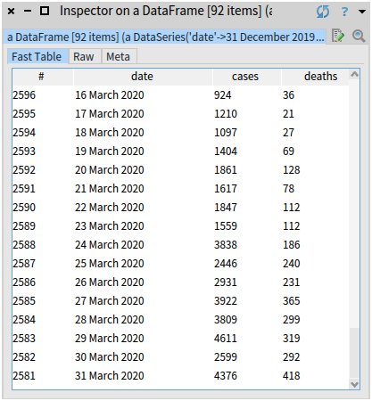

# COVID-19 Analysis

In this repository, I provide an initial setup for analysing the daily-updated COVID-19 dataset published by the European Centre for Disease Prevention and Control: https://www.ecdc.europa.eu/en/publications-data/download-todays-data-geographic-distribution-covid-19-cases-worldwide. This dataset contains the following fields: **date**, **country**, number of **cases** reported on a given day, number of **deaths** reported on a given day, and a total **population** of the country as of 2018, taken from the [World Bank Open Data](https://data.worldbank.org/).

## How to install it?

To install `CovidAnalysis`, go to the Playground (Ctrl+OW) in your [Pharo](https://pharo.org/) image and execute the following Metacello script (select it and press Do-it button or Ctrl+D):

```Smalltalk
Metacello new
  baseline: 'CovidAnalysis';
  repository: 'github://olekscode/CovidAnalysis/src';
  load.
```

## How to use it?

First create an instance of `CovidDataLoader`. This class will help you download the latest data from the Internet, clean it and load it into your image as a [DataFrame](https://github.com/PolyMathOrg/DataFrame) object.

```Smalltalk
dataLoader := CovidDataLoader new.
```

Use the following method to download the latest data. It may take a couple of seconds. The result will be stored as a CSV inside a `data/` folder of this repository.

```Smalltalk
dataLoader downloadLatestData.
```

Now you can read the downloaded data from a CSV. This method will automatically clean and parse the values of a dataset:

```Smalltalk
covidData := dataLoader loadData.
```

The result will be a data frame that looks like this:


### Example of Data Analysis

Let's find top 10 countries by the number of reported cases and number of reported deaths as of March 31, 2020:

```Smalltalk
(covidData group: 'cases' by: 'country' aggregateUsing: #sum)
	sortDescending
	head: 10.

(covidData group: 'deaths' by: 'country' aggregateUsing: #sum)
	sortDescending
	head: 10.
```


Now we will look at the historical data of how COVID-19 was spreading in one specific country, in this case - France:

```Smalltalk
covidDataFrance := covidData select: [ :row |
    (row at: 'country') = 'France' ].
```

Every row of this new data frame will have the same values in columns **country** and **population**. So we can remove those columns. But first, let's save the population of France in a separate variable, in case we need it later:

```Smalltalk
populationOfFrance := (covidDataFrance column: 'population') anyOne.

covidDataFrance removeColumns: #(country population).
```

We get the following data frame:



We can find the days on which there were the most reported cases and the most deaths in France:

```Smalltalk
maxDailyCases := (covidDataFrance column: 'cases') max. "4611"
maxDailyDeaths := (covidDataFrance column: 'deaths') max. "418"

covidDataFrance detect: [ :row | (row at: 'cases') = maxDailyCases ].
covidDataFrance detect: [ :row | (row at: 'deaths') = maxDailyDeaths ].
```


We can see that so far March 29 had the most reported cases - 4,611, and today, on March 31 there were the most deaths - 418 people died today in France.

Let's add two more columns: cumulative sum of cases and deaths. Cumulative sum tells us the total number of cases reported until the given date. For example, if there were 5 cases reported on Monday, no cases on Tuesday, and 12 cases on Wednesday, then the cumulative sum for those days will be 5 for Monday, 5 for Tuesday (5 + 0), and 17 for Wednesday (5 + 0 + 12).

```Smalltalk
cumulativeSum := [ :column |
    sum := 0.
    column collect: [ :each |
        sum := sum + each.
	sum ] ].

cumulativeCases := cumulativeSum value: (covidDataFrance column: 'cases').
cumulativeDeaths := cumulativeSum value: (covidDataFrance column: 'deaths').

covidDataFrance addColumn: cumulativeCases named: 'cumulativeCases'.
covidDataFrance addColumn: cumulativeDeaths named: 'cumulativeDeaths'.
```

Now `covidDataFrance` data frame looks like this: 


Let's find out how many days it took for disease to spread from 10 cases to 100 cases, as well as from 100 cases to 1000 cases. The following block will find the date in the given data frame on which the total number of reported cases reached the given number: 

```Smalltalk
findMilestone := [ :dataFrame :cases | 
    (dataFrame detect: [ :row | (row at: 'cumulativeCases') >= cases ]) at: 'date' ].
```

We find three milestones:

```Smalltalk
france10CasesMilestone := findMilestone value: covidDataFrance value: 10. "8 February 2020"
france100CasesMilestone := findMilestone value: covidDataFrance value: 100. "1 March 2020"
france1000CasesMilestone := findMilestone value: covidDataFrance value: 1000. "9 March 2020"
```

And calculate:

```Smalltalk
(france100CasesMilestone - france10CasesMilestone) days. "22"
(france1000CasesMilestone - france100CasesMilestone) days. "8"
```

So it took 22 days for COVID-19 to spread from 10 to 100 reported cases in France. And then only 8 more days to reach 1000 cases.
